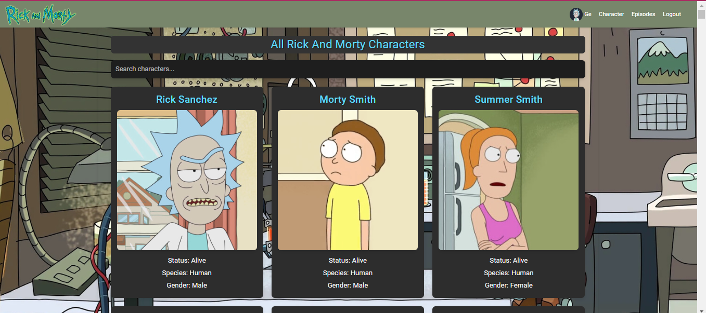

# Rick and Morty Dashboard

Este é um projeto Angular que cria um painel para visualizar informações sobre personagens e episódios da série "Rick and Morty" usando a API pública [Rick and Morty API](https://rickandmortyapi.com/).

<h1>
    
    
    
</h1>

## Funcionalidades

- Visualização de todos os personagens e episódios.
- Pesquisa de personagens e episódios.
- Visualização de detalhes de um personagem ou episódio específico.
- Login e logout com autenticação simulada.
- Navegação protegida por guarda de autenticação.

## Estrutura do Projeto

### Módulos

- **CoreModule**: Contém os componentes globais, como `Header` e `Footer`
- **FeaturesModule**: Contém os componentes principais, como `CharactersComponent`, `EpisodesComponent`, `CharacterDetailsComponent` e `EpisodeDetailsComponent`.

### Serviços

- **AuthService**: Gerencia a autenticação do usuário.
- **Services**: Fornece métodos para consumir a API Rick and Morty.

### Componentes

- **HeaderComponent**: Componente de cabeçalho com menu de navegação.
- **FooterComponent**: Componente de rodapé.
- **CharactersComponent**: Lista todos os personagens.
- **EpisodesComponent**: Lista todos os episódios.
- **CharacterDetailsComponent**: Exibe detalhes de um personagem.
- **EpisodeDetailsComponent**: Exibe detalhes de um episódio.

### Rotas

As rotas definidas para o projeto estão no arquivo `routes.ts`. Incluem:

- `/characters`: Exibe a lista de personagens (protegida por autenticação).
- `/characters/:id`: Exibe os detalhes de um personagem (protegida por autenticação).
- `/episodes`: Exibe a lista de episódios (protegida por autenticação).
- `/episode/:id`: Exibe os detalhes de um episódio (protegida por autenticação).
- `/login`: Página de login.
- `/profile`: Página de perfil do usuário (protegida por autenticação).
- `**`: Redireciona para a página de login.

## Pré-requisitos

- Node.js
- Angular CLI

## Instalação

1. Clone o repositório:

   ```bash
   git clone https://github.com/gersonreismelo/rick-morty-dashboard
   cd rick-morty-dashboard
   ```

2. Instale as dependências:

    ```bash
    npm install
    ```

3. Inicie o servidor de desenvolvimento:

    ```bash
    npm start
    ```

4. Acesse o painel no navegador:

    ```bash
    http://localhost:4200
    ```


## Dependências

- Angular
- Angular Material
- Bootstrap
- RxJS

## Autor
 Gerson dos Reis de Melo

## Licença
Este projeto é licenciado sob os termos da [LICENSE  MIT](./LICENSE).
